# AI-IDS: Artificial Intelligence Intrusion Detection System

**Version:** 3.0  
**Architecture Pattern:** Clean Architecture + SOLID Principles + Repository Pattern + IoC Container  
**Presentation:** Streamlit multi-page application  
**Persistence:** SQLite (relational)  
**ML Runtime:** scikit-learn 1.9 + XGBoost (multi-class, 70 features, 15 classes)  
**Test Coverage:** 263 automated tests  

---

## Table of Contents

1. [System Architecture](#1-system-architecture)
2. [Use Case Diagram](#2-use-case-diagram)
3. [Data Flow Diagram](#3-data-flow-diagram)
4. [Entity-Relationship Diagram](#4-entity-relationship-diagram)
5. [Sequence Diagrams](#5-sequence-diagrams)
6. [Database Schema](#6-database-schema)
7. [Dependency Injection Container](#7-dependency-injection-container)
8. [Machine Learning Layer](#8-machine-learning-layer)
9. [Network Capture Layer](#9-network-capture-layer)
10. [File Structure](#10-file-structure)

---

## 1. System Architecture

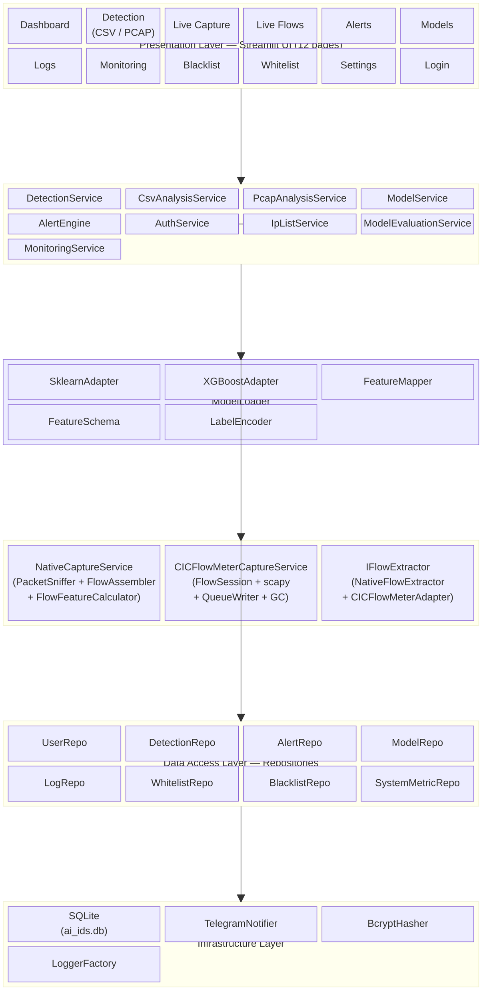

### Layer Responsibilities

| Layer | Responsibility | Key Components |
|-------|---------------|----------------|
| **Presentation** | Interactive web UI via Streamlit | 12 multi-page views, auth guard |
| **Services** | Business logic, orchestration, validation | DetectionService, AlertEngine, ModelService, AuthService |
| **ML** | Model loading, inference, feature alignment | ModelLoader, IModelAdapter, FeatureMapper, FeatureSchema |
| **Capture** | Packet sniffing, flow assembly, feature extraction | PacketSniffer, FlowAssembler, FlowFeatureCalculator, CICFlowMeter |
| **Repositories** | Data access abstraction over SQLite | 8 typed repository classes |
| **Infrastructure** | Cross-cutting concerns | SQLite persistence, Telegram notifications, password hashing, structured logging |

---

## 2. Use Case Diagram

```mermaid
usecaseDiagram
    actor "System Admin" as Admin
    actor "Input Channel\n(CSV / PCAP / Network)" as InputChannel
    actor "ML Engine" as MLEngine
    actor "Telegram Bot" as TelegramBot

    package "AI-IDS System" {
        usecase "UC-01: User Authentication" as UC01
        usecase "UC-02: Model Management\n(Register / Activate / Deactivate / Evaluate)" as UC02
        usecase "UC-03a: Analyze CSV File" as UC03a
        usecase "UC-03b: Analyze PCAP File" as UC03b
        usecase "UC-03c: Live Network Capture" as UC03c
        usecase "UC-03d: View Live Flows" as UC03d
        usecase "UC-04: IP List Management\n(Blacklist / Whitelist)" as UC04
        usecase "UC-05: Threat Detection\n(Feature Mapping + Classification\n+ Severity + Attack Type)" as UC05
        usecase "UC-06: Persist Detection Record" as UC06
        usecase "UC-07: Alert Aggregation\n& Escalation" as UC07
        usecase "UC-08: View Dashboard" as UC08
        usecase "UC-09: View Logs & Reports" as UC09
        usecase "UC-10: System Monitoring\n(CPU / RAM / Disk / Network)" as UC10
        usecase "UC-11: User & Settings\nManagement" as UC11
    }

    Admin --> UC01
    Admin --> UC02
    Admin --> UC04
    Admin --> UC08
    Admin --> UC09
    Admin --> UC10
    Admin --> UC11

    UC01 ..> UC02 : <<extend>>
    UC01 ..> UC04 : <<extend>>
    UC01 ..> UC08 : <<extend>>

    InputChannel --> UC03a
    InputChannel --> UC03b
    InputChannel --> UC03c

    UC03a --> UC05 : <<include>>
    UC03b --> UC05 : <<include>>
    UC03c --> UC05 : <<include>>

    UC05 --> UC06 : <<include>>
    UC05 --> UC07

    MLEngine --> UC05

    UC07 --> TelegramBot : <<include>>

    UC03c --> UC03d
```

### Use Case Relationship Matrix

| Relationship | Stereotype | Semantics |
|-------------|-----------|-----------|
| UC-01 → UC-02 | `<<extend>>` | Authentication is a precondition for model management |
| UC-01 → UC-04 | `<<extend>>` | Authentication is a precondition for IP list management |
| UC-01 → UC-08 | `<<extend>>` | Authentication is a precondition for dashboard access |
| UC-03a → UC-05 | `<<include>>` | CSV analysis always invokes threat detection |
| UC-03b → UC-05 | `<<include>>` | PCAP analysis always invokes threat detection |
| UC-03c → UC-05 | `<<include>>` | Live capture always invokes threat detection |
| UC-05 → UC-06 | `<<include>>` | Detection always persists a record to DB |
| UC-07 → TelegramBot | `<<include>>` | Alert escalation always dispatches Telegram notification |

### Use Case Specification Table

| ID | Use Case | Actor(s) | Preconditions | Postconditions | Trigger |
|----|----------|----------|---------------|----------------|---------|
| UC-01 | User Authentication | Admin | — | Active session established | Login form submission |
| UC-02 | Model Management | Admin | UC-01 complete | Model registered/activated/deactivated/evaluated | Model file upload or toggle |
| UC-03a | Analyze CSV File | Input Channel | Active model exists | Classification results per row | CSV file upload |
| UC-03b | Analyze PCAP File | Input Channel | Active model exists | Classification results per flow | PCAP file upload |
| UC-03c | Live Network Capture | Input Channel | Active model, interface selected | Real-time classified flows | Capture start |
| UC-03d | View Live Flows | Admin | UC-03c running | Live flow table with predictions | Page refresh |
| UC-04 | IP List Management | Admin | UC-01 complete | Blacklist/whitelist updated | Add/remove/import/export |
| UC-05 | Threat Detection | ML Engine | Feature vector available | class_index, confidence, severity, attack_type | Inference call |
| UC-06 | Persist Detection Record | System | UC-05 complete | Detection row in SQLite | UC-05 completion |
| UC-07 | Alert Aggregation & Escalation | System | UC-06 complete | Alert created/updated, Telegram sent if threshold met | UC-06 with malicious prediction |
| UC-08 | View Dashboard | Admin | UC-01 complete | Aggregated metrics, charts | Page navigation |
| UC-09 | View Logs & Reports | Admin | UC-01 complete | Filtered, searchable log data | Page navigation |
| UC-10 | System Monitoring | Admin | UC-01 complete | Live CPU/RAM/Disk/Network metrics | Page navigation |
| UC-11 | User & Settings Management | Admin | UC-01 complete | User/setting records updated | Form submission |

---

## 3. Data Flow Diagram

### 3.1 High-Level Data Flow

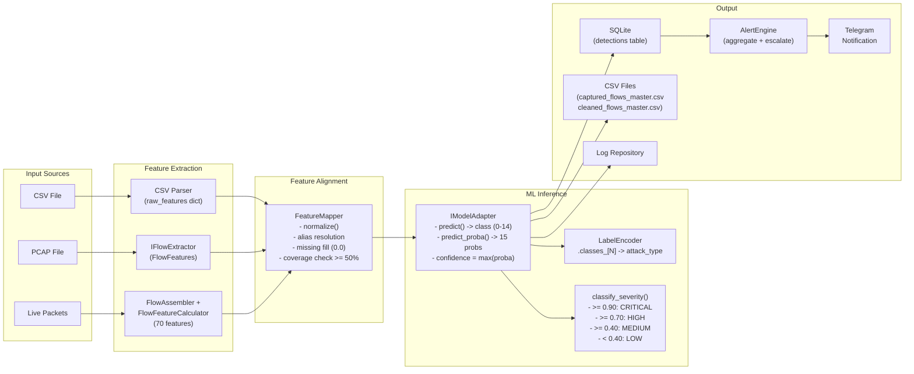

### 3.2 Feature Alignment Pipeline

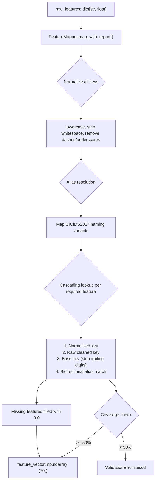

---

## 4. Entity-Relationship Diagram

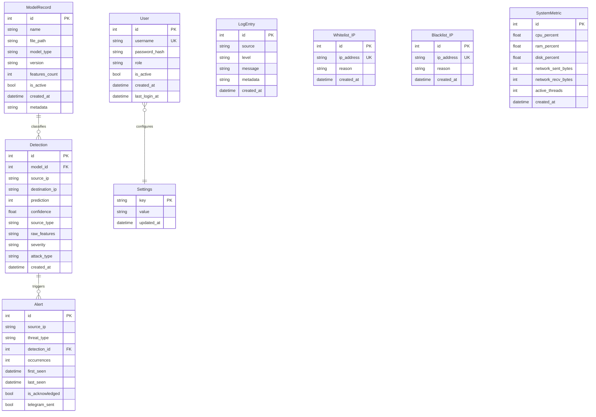

### Relationship Summary

| Relationship | Cardinality | Description |
|-------------|-------------|-------------|
| ModelRecord → Detection | 1 : N | Each detection is produced by exactly one model |
| Detection → Alert | 1 : N | A single detection may generate multiple alerts (aggregated) |

---

## 5. Sequence Diagrams

### 5.1 Threat Detection Pipeline (CSV / PCAP / Live)

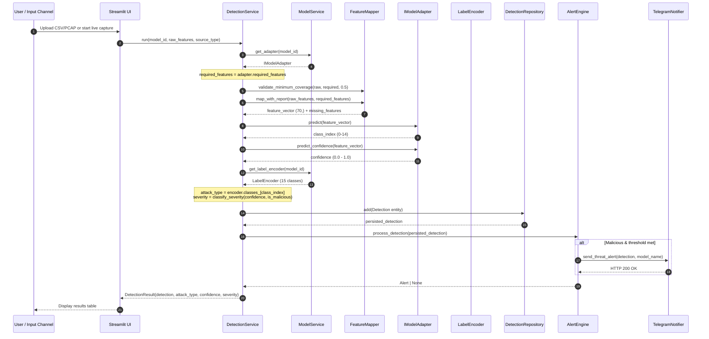

### 5.2 Live Capture Pipeline

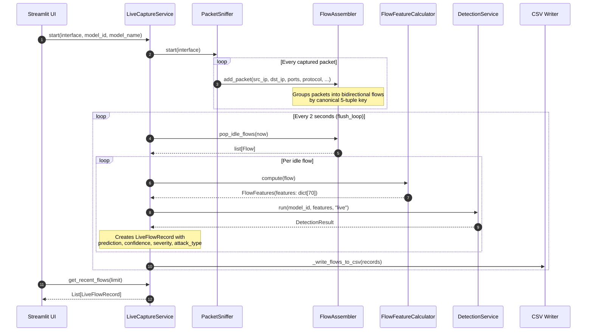

### 5.3 Authentication Sequence

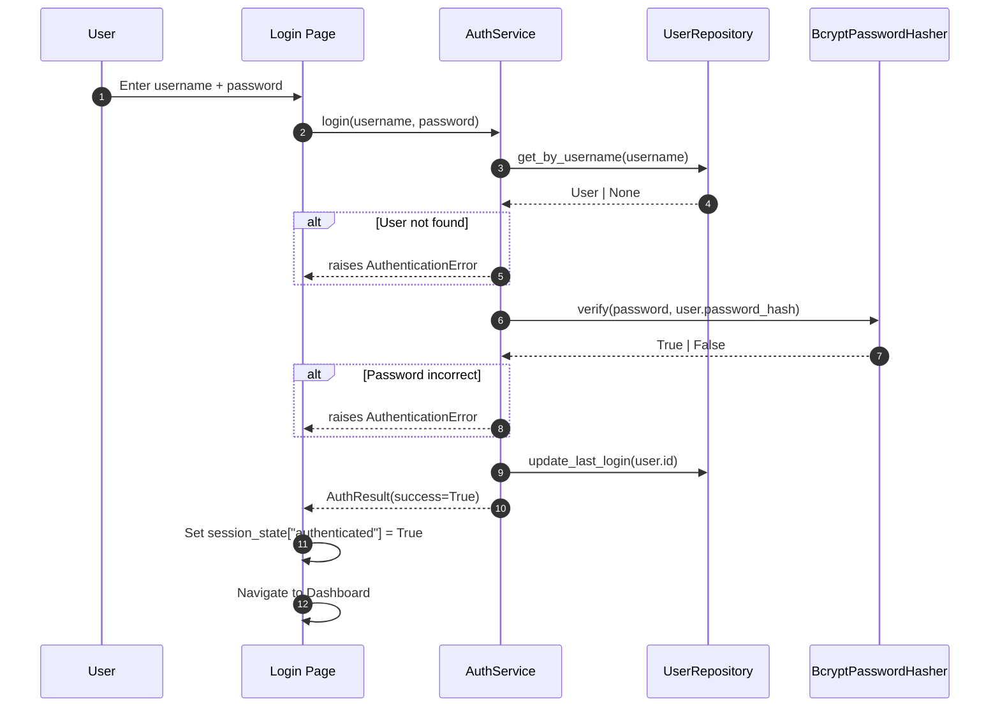

### 5.4 Alert Escalation Sequence

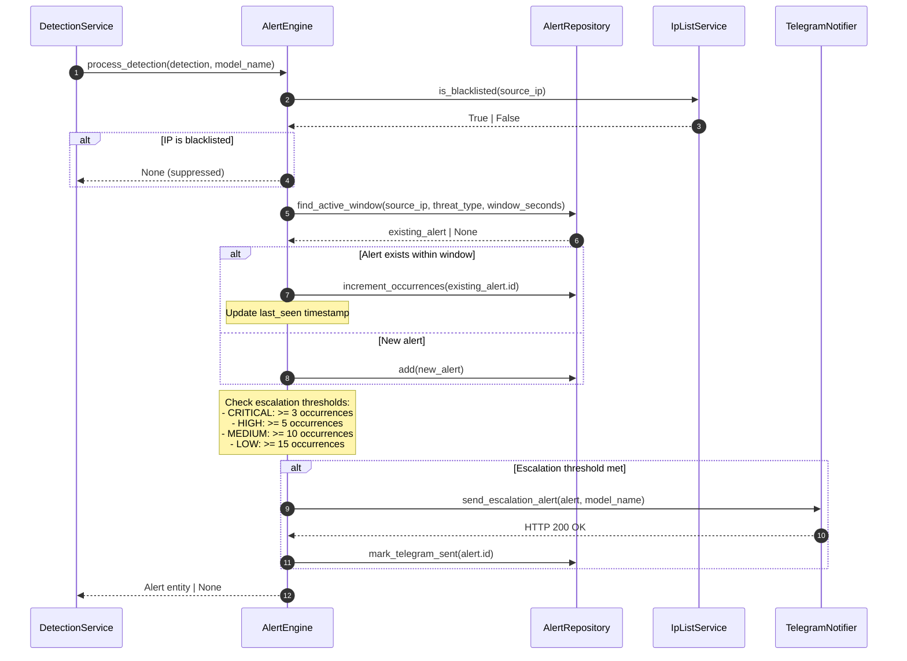

---

## 6. Database Schema

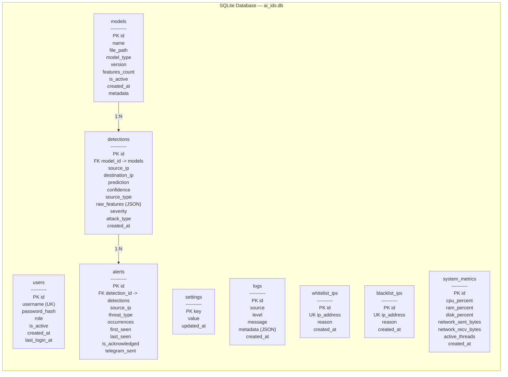

### Performance Indexes

| Index Name | Table | Columns | Purpose |
|-----------|-------|---------|---------|
| `idx_detections_created_at` | detections | created_at | Time-range queries on detection history |
| `idx_alerts_source_ip` | alerts | source_ip | IP-based alert lookups |
| `idx_logs_created_at` | logs | created_at | Log chronology queries |
| `idx_logs_source` | logs | source | Filter by log source module |
| `idx_logs_level` | logs | level | Filter by severity level |
| `idx_logs_source_level` | logs | (source, level) | Composite filter for targeted diagnostics |
| `idx_whitelist_ip` | whitelist_ips | ip_address | Fast IP whitelist membership check |
| `idx_blacklist_ip` | blacklist_ips | ip_address | Fast IP blacklist membership check |

### Schema Migrations

Two automatic migrations run on startup for existing databases:
- `_migrate_add_severity()`: Adds `severity TEXT NOT NULL DEFAULT ''` to `detections`
- `_migrate_add_attack_type()`: Adds `attack_type TEXT NOT NULL DEFAULT ''` to `detections`

---

## 7. Dependency Injection Container

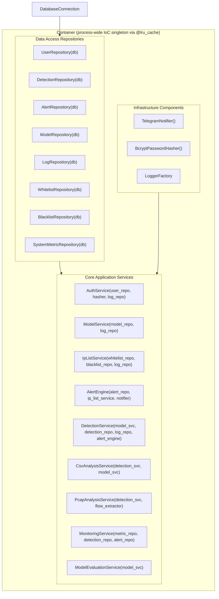

### Dependency Resolution Order

| Priority | Component | Dependencies |
|----------|-----------|-------------|
| 1 | `DatabaseConnection` | SQLite file path |
| 2 | Repositories (8) | `DatabaseConnection` |
| 3 | `TelegramNotifier` | Environment variables (BOT_TOKEN, CHAT_ID) |
| 4 | `BcryptPasswordHasher` | — |
| 5 | `AuthService` | UserRepository, BcryptPasswordHasher, LogRepository |
| 6 | `ModelService` | ModelRepository, LogRepository |
| 7 | `IpListService` | WhitelistRepository, BlacklistRepository, LogRepository |
| 8 | `AlertEngine` | AlertRepository, IpListService, TelegramNotifier |
| 9 | `DetectionService` | ModelService, DetectionRepository, LogRepository, AlertEngine |
| 10 | `CsvAnalysisService` | DetectionService, ModelService |
| 11 | `PcapAnalysisService` | DetectionService, IFlowExtractor |
| 12 | `MonitoringService` | SystemMetricRepository, DetectionRepository, AlertRepository |

All services are lazily instantiated as process-wide singletons.

---

## 8. Machine Learning Layer

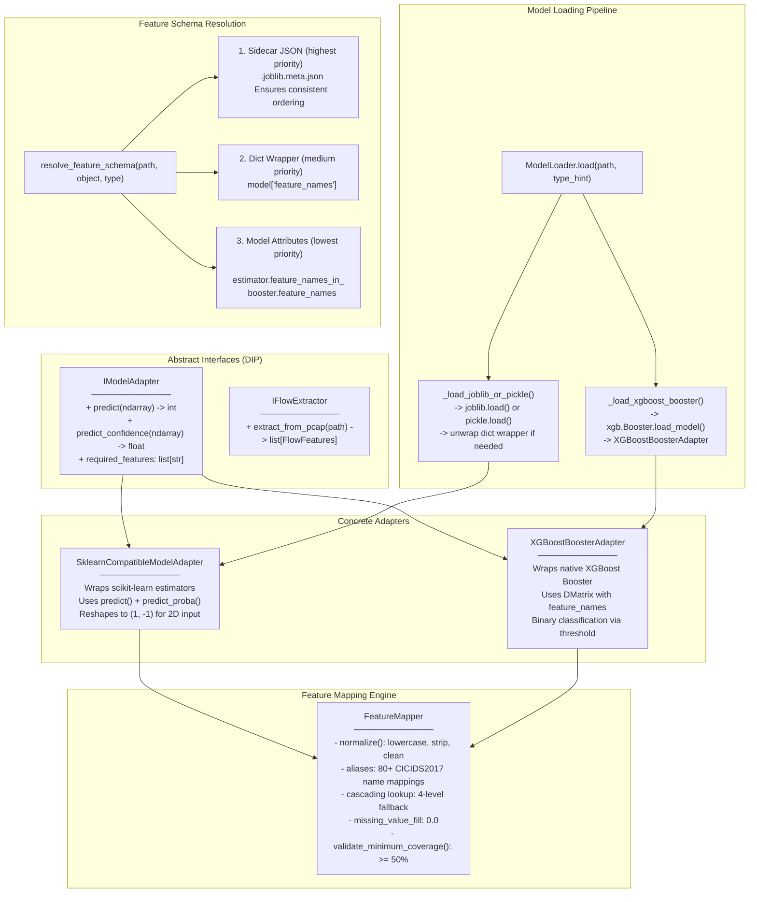

### Model Specifications

| Property | Random Forest V3 | XGBoost Pipeline V2 |
|----------|-----------------|---------------------|
| File | `random_forest_v3.joblib` (24 MB) | `xgboost_pipeline_v2.joblib` (1.1 MB) |
| Type | `RandomForestClassifier` | `XGBClassifier` |
| Estimators | 150 decision trees | Gradient boosted trees |
| Features | 70 (CICIDS2017) | 70 (CICIDS2017) |
| Classes | 15 (multi-class) | 15 (multi-class) |
| `predict_proba()` | Yes (15-class softmax) | Yes (15-class softmax) |
| Sidecar | `random_forest_v3.joblib.meta.json` | `xgboost_pipeline_v2.joblib.meta.json` |
| Feature ordering | Identical to XGBoost | Identical to RF |

### Label Encoder Classes (15)

| Index | Class Name | Index | Class Name |
|-------|-----------|-------|-----------|
| 0 | BENIGN | 8 | Heartbleed |
| 1 | Bot | 9 | Infiltration |
| 2 | DDoS | 10 | PortScan |
| 3 | DoS GoldenEye | 11 | SSH-Patator |
| 4 | DoS Hulk | 12 | Web Attack - Brute Force |
| 5 | DoS Slowhttptest | 13 | Web Attack - Sql Injection |
| 6 | DoS slowloris | 14 | Web Attack - XSS |
| 7 | FTP-Patator | | |

### Severity Classification

| Condition | Severity |
|-----------|----------|
| `prediction == 0` (BENIGN) | `""` (empty) |
| `confidence >= 0.90` | `CRITICAL` |
| `confidence >= 0.70` | `HIGH` |
| `confidence >= 0.40` | `MEDIUM` |
| `confidence < 0.40` | `LOW` |

---

## 9. Network Capture Layer

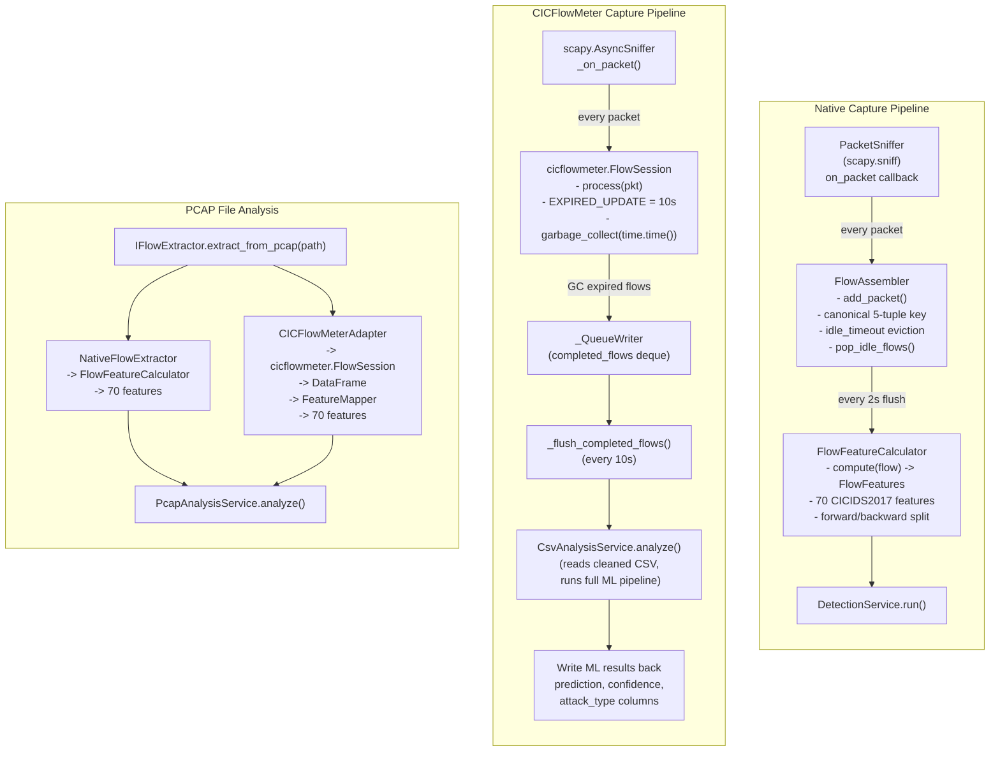

### Bug Fixes Applied to CICFlowMeter Integration

| Bug | Symptom | Fix |
|-----|---------|-----|
| **BUG #1 (Fatal)** | `FlowSession.__init__` crashes: `RuntimeError("no output_mode provided")` | Monkey-patch `output_writer_factory` in module namespace to return `_QueueWriter` when `output_mode=None` |
| **BUG #2** | `toPacketList()` deletes `output_writer` when sniffer stops | Wrap with `_safe_toPacketList()` that does GC and returns empty `PacketList` without deleting writer |
| **BUG #3** | `EXPIRED_UPDATE = 240s` too slow for IDS latency | Patch `_fs_mod.EXPIRED_UPDATE = 10` (10-second flow expiry) |
| **BUG #4** | `process()` only calls GC every 1000 packets | Restore `garbage_collect(time.time())` call in flush thread |

---

## 10. File Structure

```
AI_IDS_3/
├── cli.py                          # Command-line interface (8 commands)
├── main.py                         # Application entry point
├── ARCHITECTURE.md                 # This document
├── DEPLOYMENT_FILES.txt            # Deployment manifest (73+ items)
├── requirements.txt                # Python dependencies
├── .env                            # Environment configuration
│
├── config/
│   ├── constants.py                # Enums, thresholds, defaults
│   └── settings.py                 # Pydantic settings, path resolution
│
├── core/
│   ├── entities/
│   │   ├── user.py                 # User domain entity
│   │   ├── detection.py            # Detection domain entity + classify_severity()
│   │   ├── alert.py                # Alert domain entity
│   │   ├── model_record.py         # ModelRecord domain entity
│   │   ├── log_entry.py            # LogEntry domain entity
│   │   ├── ip_list_entry.py        # IP list entry domain entity
│   │   └── system_metric.py        # SystemMetric domain entity
│   └── exceptions.py               # Custom exception hierarchy
│
├── database/
│   ├── connection.py               # SQLite connection management
│   └── schema.py                   # DDL, indexes, migrations
│
├── ml/
│   ├── interfaces.py               # IModelAdapter, IFlowExtractor (ABCs)
│   ├── model_loader.py             # Deserialization broker (joblib/pickle/xgboost)
│   ├── model_adapter.py            # SklearnCompatibleModelAdapter
│   ├── xgboost_booster_adapter.py  # XGBoostBoosterAdapter
│   ├── feature_mapper.py           # Semantic feature alignment engine
│   ├── feature_schema.py           # Dynamic schema resolution (sidecar-first)
│   └── cicflowmeter_adapter.py     # CICFlowMeter PCAP adapter
│
├── capture/
│   ├── packet_sniffer.py           # scapy-based packet sniffer
│   ├── flow.py                     # Flow data structure
│   ├── flow_assembler.py           # 5-tuple flow grouping + idle eviction
│   ├── flow_feature_calculator.py  # 70-feature CICIDS2017 calculator
│   ├── live_capture_service.py     # Native capture pipeline (singleton)
│   ├── cicflowmeter_live_capture_service.py  # CICFlowMeter capture pipeline
│   ├── native_pcap_extractor.py    # PCAP extractor (native)
│   ├── cicflowmeter_adapter.py     # PCAP extractor (CICFlowMeter)
│   └── extractor_factory.py        # Extractor factory (env-based selection)
│
├── repositories/
│   ├── user_repository.py
│   ├── detection_repository.py
│   ├── alert_repository.py
│   ├── model_repository.py
│   ├── log_repository.py
│   ├── whitelist_repository.py
│   ├── blacklist_repository.py
│   └── system_metric_repository.py
│
├── services/
│   ├── container.py                # IoC composition root
│   ├── detection_service.py        # Unified inference orchestrator
│   ├── csv_analysis_service.py     # Batch CSV analysis
│   ├── pcap_analysis_service.py    # PCAP file analysis
│   ├── model_service.py            # Model registry + adapter cache
│   ├── alert_engine.py             # Alert aggregation + escalation
│   ├── auth_service.py             # Authentication + password management
│   ├── ip_list_service.py          # Blacklist/whitelist operations
│   ├── monitoring_service.py       # System metrics collection
│   └── model_evaluation_service.py # Model performance evaluation
│
├── infrastructure/
│   ├── logging/
│   │   └── logger_factory.py       # Structured logging factory
│   ├── notifications/
│   │   └── telegram_notifier.py    # Async Telegram notifications
│   └── security/
│       └── password_hasher.py      # Bcrypt password hashing
│
├── ui/
│   ├── app.py                      # Streamlit app entry point
│   ├── auth_guard.py               # Session-based auth guard
│   └── pages/
│       ├── login.py                # Authentication page
│       ├── dashboard.py            # System overview dashboard
│       ├── detection.py            # CSV & PCAP analysis
│       ├── live_capture.py         # Live capture control
│       ├── live_flows.py           # Live flow viewer
│       ├── alerts.py               # Alert management
│       ├── logs.py                 # System logs viewer
│       ├── models.py               # Model registry management
│       ├── monitoring.py           # System resource monitoring
│       ├── blacklist.py            # IP blacklist management
│       ├── whitelist.py            # IP whitelist management
│       └── settings.py             # Application settings
│
├── models/                         # Trained ML model artifacts
│   ├── random_forest_v3.joblib     # Random Forest V3 (70 features, 15 classes)
│   ├── random_forest_v3.joblib.meta.json
│   ├── xgboost_pipeline_v2.joblib  # XGBoost V2 (70 features, 15 classes)
│   ├── xgboost_pipeline_v2.joblib.meta.json
│   ├── label_encoder.joblib        # LabelEncoder (15 attack classes)
│   └── scaler.joblib               # StandardScaler
│
└── tests/
    ├── test_database.py            # Database + repository tests (30)
    ├── test_repositories.py        # Repository + service tests (17)
    ├── test_security.py            # Auth, password, validation tests (40)
    ├── test_capture_layer.py       # Capture layer tests (31)
    ├── test_ml_layer.py            # ML layer tests (24)
    ├── test_telegram_notifier.py   # Telegram notifier tests (30)
    ├── test_services_layer.py      # Service integration tests (27)
    └── test_model_integration.py   # End-to-end model tests (29)
```
